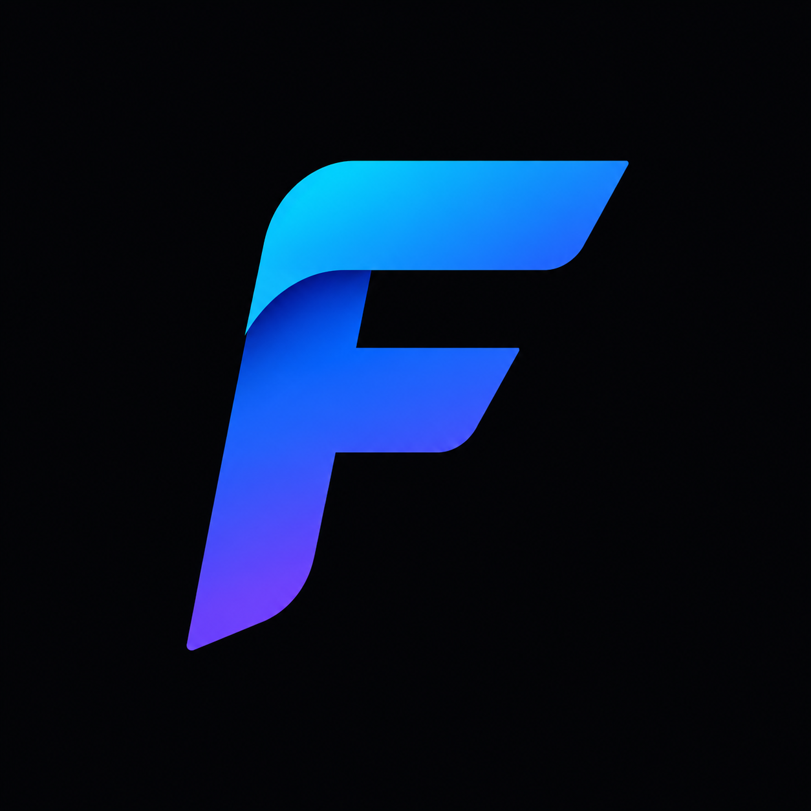

  

  

#  Hey, I'm Leo

I'm a Brazilian-Argentine student interested in computer science, accessibility, artificial intelligence, and systems.

I enjoy building projects, learning how technology works under the hood, and exploring ways software can improve people's lives.

##  Work in progress

*  **Focuda** — technology focused on accessibility and digital inclusion
*  **AI Projects** — experimenting with language models and educational tools
*  **Infrastructure & Servers** — cloud platforms, networking, and deployment

## 🛠️ Technologies

<table align="center">
<tr>
<td align="center" width="300">

### Languages

JavaScript • TypeScript • Python

</td>

<td align="center" width="300">

### Frontend

React • Next.js • Astro

</td>
</tr>

<tr>
<td align="center" width="300">

### Backend

Node.js • Express • Django

</td>

<td align="center" width="300">

### Databases

MySQL • MongoDB

</td>
</tr>

<tr>
<td colspan="2" align="center">

### Infrastructure & Cloud

Docker • Git • Linux • Nginx • AWS • Azure • GCP

</td>
</tr>

</table>

  Python • Java • JavaScript • HTML • CSS • Linux • Git • GitHub

##  Currently Learning 

* Data Structures & Algorithms
* Computer Networks
* Operating Systems
* Artificial Intelligence
* Accessibility Engineering
* Software Architecture

##  Projects

###   Focuda

A project focused on building accessible technology and reducing barriers in the digital world.

###  Sofi

An AI-powered college counseling assistant designed to help students plan their academic future.

##  Beyond Coding

* 🏆 Winner of Hackathon Buenos Aires 2025
* 🎤 Speaker at the opening event of TUMO Buenos Aires
* 💼 IT at Kátedra
* 🏫 School Flag Bearer
* 👨‍💼 Class President for 4 consecutive years

##  GitHub Statistics

  

  

## 
  Contact information 

  
  &nbsp;&nbsp;
  
  &nbsp;&nbsp;
  

  <a href="https://www.linkedin.com/in/leonardo-felipe-stefaniszen-maiczuk-675386366/?lipi=urn%3Ali%3Apage%3Ad_flagship3_profile_view_base_contact_details%3BAxs1fV%2BPRja3wftSohH44w%3D%3D">LinkedIn</a>
  •
  <a href="mailto:leo.stefaniszen@gmail.com">Email</a>
  •
  <a href="https://">Portfolio</a>

  Open to collaboration, research, and building impactful technology.

  

